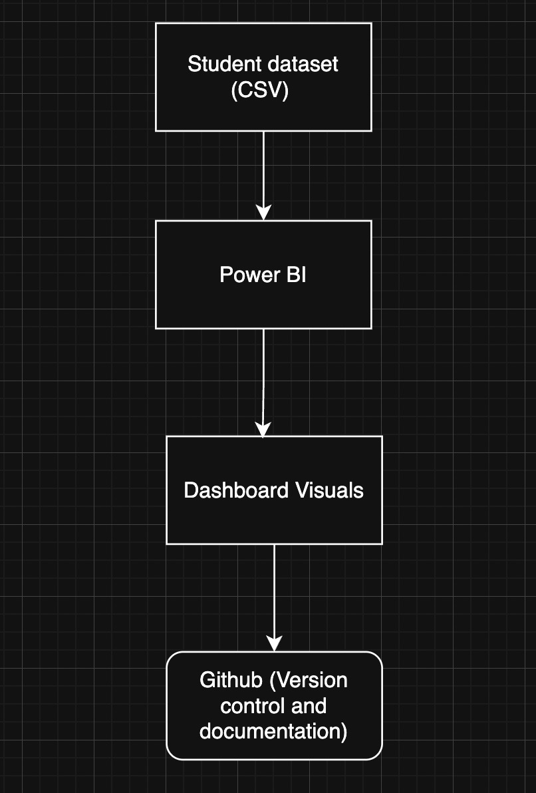

# Student Performance Analytics

A Power BI dashboard project analyzing student performance metrics using GitHub for version control.

## Project Overview
This project visualizes student academic performance using Power BI.  
It focuses on:
- Average marks by subject
- Average marks by semester
- Average attendance by department
- Interactive filtering using slicers

## Dataset
The dataset contains:
- Student ID
- Student Name
- Department (CSE, IT)
- Subject
- Marks
- Attendance Percentage
- Semester

Location:

dataset/student_performance.csv

## Dashboard Features
- **Average Marks by Subject**
- **Average Marks by Semester**
- **Average Attendance by Department**
- **Department slicer** for interactive filtering

## Screenshots

### Dashboard Overview

### When department is CSE

### When department is IT

## Tools Used
- Power BI

- ## Conclusion
This project demonstrates how Power BI can be used for academic performance analysis,
with GitHub enabling version control and documentation of analytics workflows.
- GitHub
- CSV Dataset

## Author
Soham Sharma

## Project Objective
To analyze student academic performance using data visualization techniques and build an
interactive dashboard using Power BI, while maintaining the project using GitHub version control.

## Tools & Technologies

| Tool      | Purpose |
|-----------|---------|
| Power BI  | Data visualization and dashboard creation |
| GitHub   | Version control and project tracking |
| CSV      | Dataset storage |

## Project Workflow

The following diagram illustrates the overall workflow of the project:

1. Student performance data is collected and stored in CSV format.
2. The dataset is imported into Power BI for analysis.
3. Interactive dashboards and visualizations are created.
4. The project files, documentation, and screenshots are maintained using GitHub.

