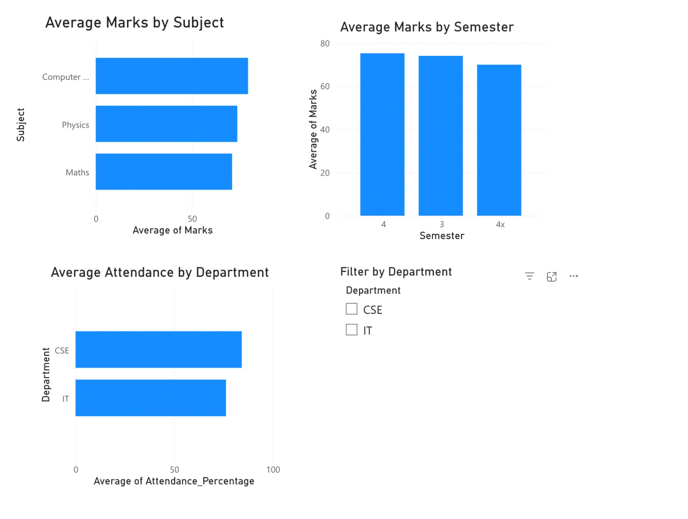
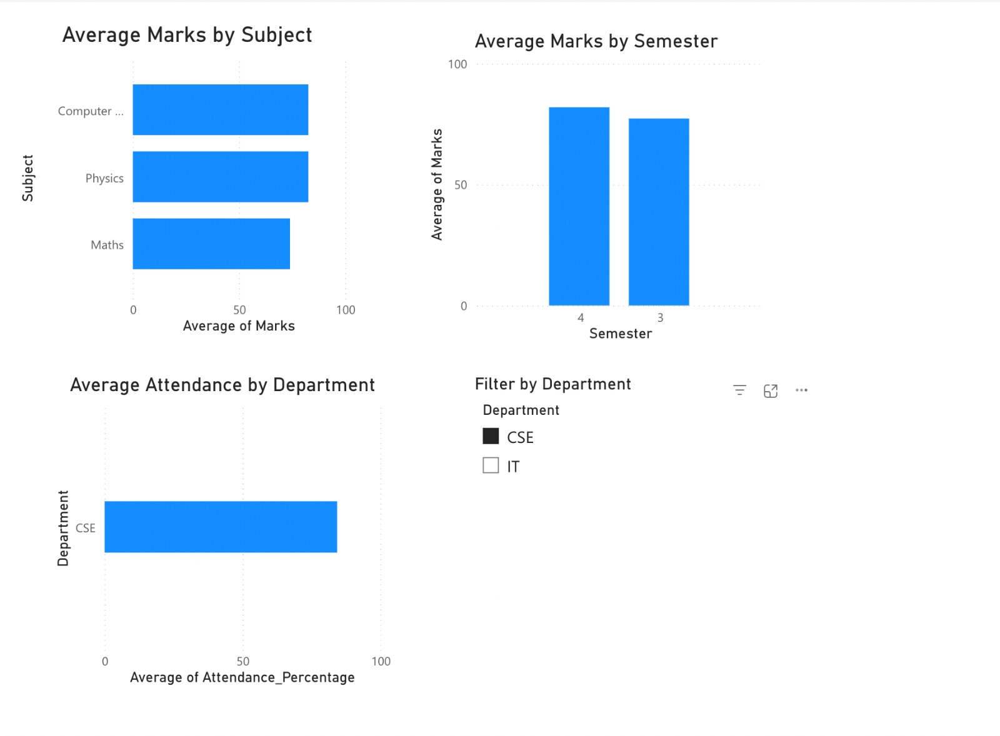
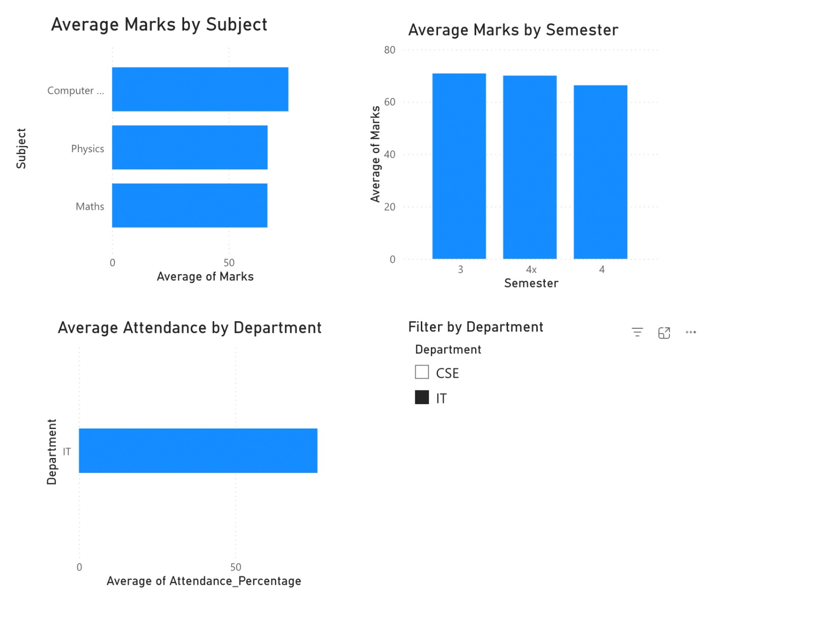

# Student Performance Analytics

A Power BI dashboard project analyzing student performance metrics using GitHub for version control.

## Project Overview
This project visualizes student academic performance using Power BI.  
It focuses on:
- Average marks by subject
- Average marks by semester
- Average attendance by department
- Interactive filtering using slicers

## Dataset
The dataset contains:
- Student ID
- Student Name
- Department (CSE, IT)
- Subject
- Marks
- Attendance Percentage
- Semester

Location:

dataset/student_performance.csv

## Dashboard Features
- **Average Marks by Subject**
- **Average Marks by Semester**
- **Average Attendance by Department**
- **Department slicer** for interactive filtering

## Screenshots

### Dashboard Overview

### When department is CSE

### When department is IT

## Tools Used
- Power BI
- GitHub
- CSV Dataset

## Author
Soham Sharma
