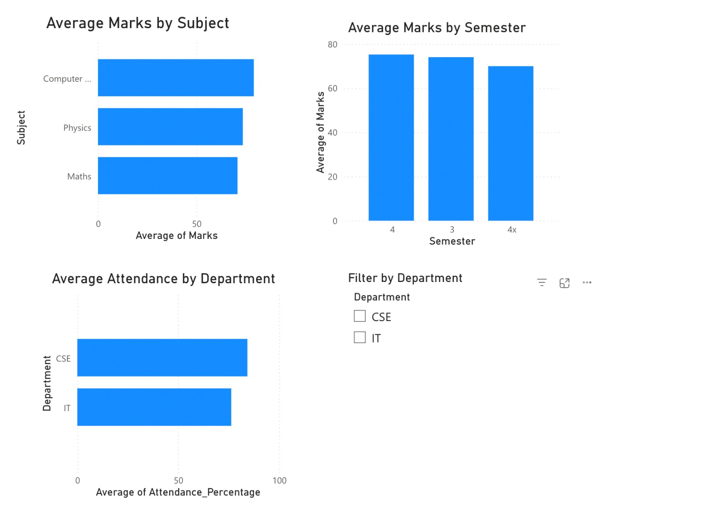
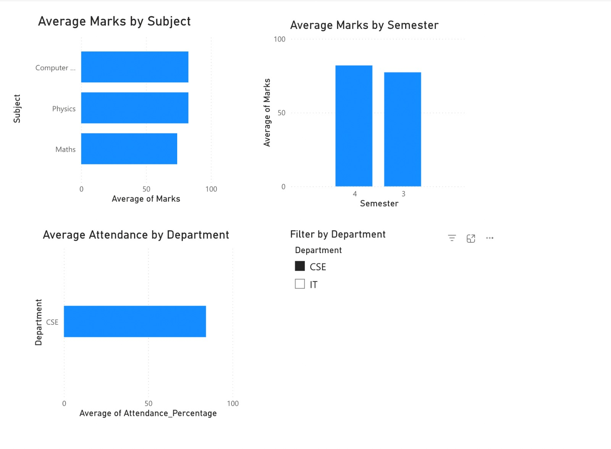
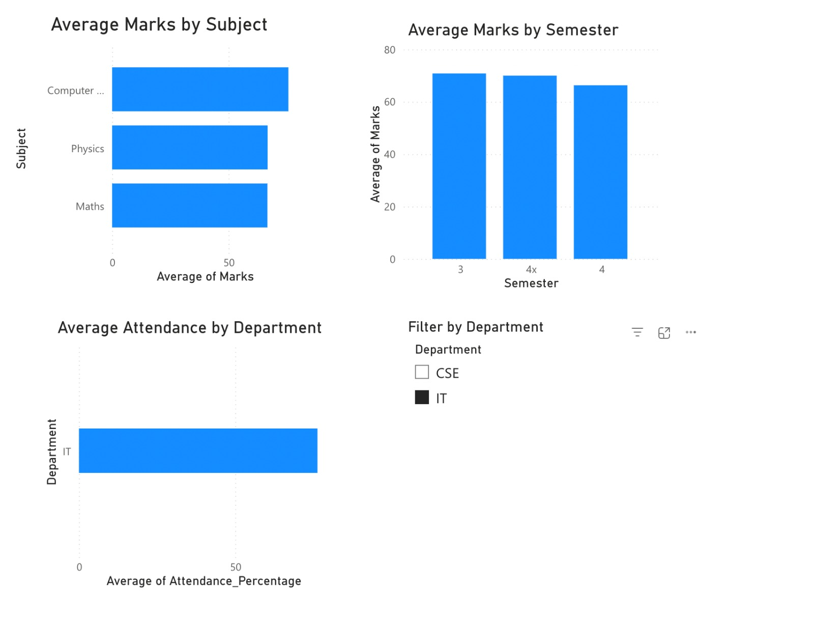
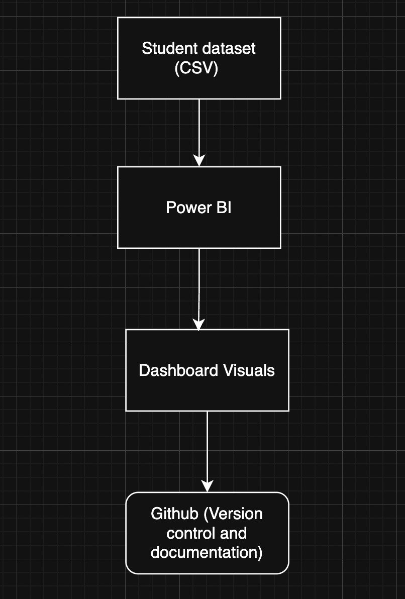
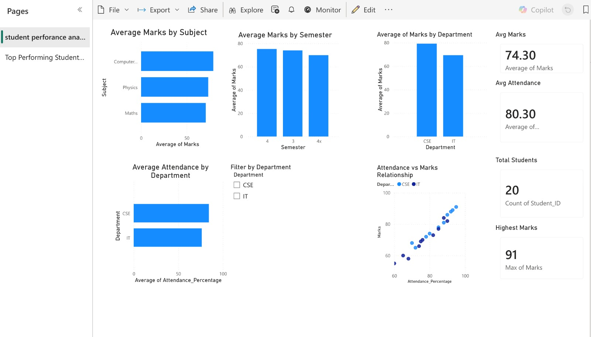
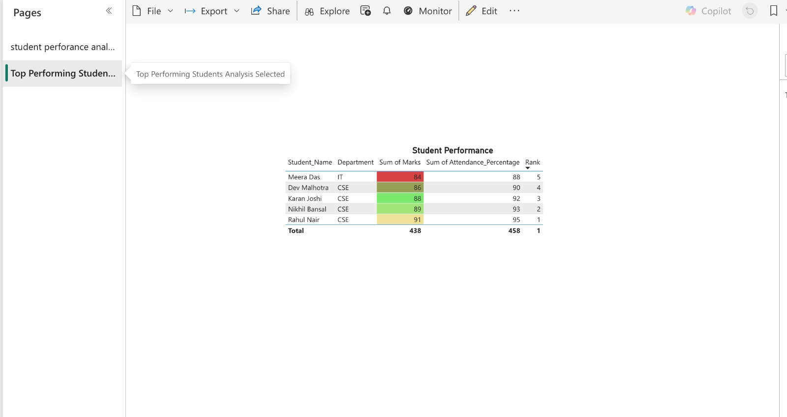

# Student Performance Analytics Dshboard(POWER BI)

A Power BI dashboard project analyzing student performance metrics using GitHub for version control.

## Project Overview
This project visualizes student academic performance using Power BI.  
It focuses on:
- Average marks by subject
- Average marks by semester
- Average attendance by department
- Interactive filtering using slicers

## Dataset
The dataset contains:
- Student ID
- Student Name
- Department (CSE, IT)
- Subject
- Marks
- Attendance Percentage
- Semester

Location:

dataset/student_performance.csv

## Dashboard Features
- **Average Marks by Subject**
- **Average Marks by Semester**
- **Average Attendance by Department**
- **Department slicer** for interactive filtering

## Screenshots

### Dashboard Overview

### When department is CSE

### When department is IT

## Tools Used
- Power BI

- ## Conclusion
This project demonstrates how Power BI can be used for academic performance analysis,
with GitHub enabling version control and documentation of analytics workflows.
- GitHub
- CSV Dataset

## Author
Soham Sharma

## Project Objective
To analyze student academic performance using data visualization techniques and build an
interactive dashboard using Power BI, while maintaining the project using GitHub version control.

## Tools & Technologies

| Tool      | Purpose |
|-----------|---------|
| Power BI  | Data visualization and dashboard creation |
| GitHub   | Version control and project tracking |
| CSV      | Dataset storage |

## Project Workflow

The following diagram illustrates the overall workflow of the project:

1. Student performance data is collected and stored in CSV format.
2. The dataset is imported into Power BI for analysis.
3. Interactive dashboards and visualizations are created.
4. The project files, documentation, and screenshots are maintained using GitHub.

## Future Scope

This project can be expanded in several ways:

- Integration of larger and real-world datasets.
- Adding predictive analytics to forecast student performance.
- Automating data updates for real-time dashboards.
- Expanding analysis to include more academic metrics such as assignments and exam scores.

## Project Structure

dataset/
- Contains the student performance dataset used for analysis.

dataset/powerbi/
- Contains Power BI related project files and documentation.

dataset/powerbi/report/screenshots/
- Screenshots of the Power BI dashboard visuals.

report/
- Contains analysis and project documentation files.

report/data_analysis.md
- Summary of insights derived from the dashboard.

report/project_summary.md
- Overview and explanation of the project.

## Key Insights

From the dashboard analysis, several insights can be observed:

- Some subjects show higher average marks, indicating stronger student performance.
- Attendance appears to have a positive relationship with marks, as seen in the scatter plot.
- Department-wise comparisons show variations in both attendance and academic performance.
- The interactive slicer allows quick filtering of data to compare department trends.

## 📸 Final Dashboard Screenshots

### Dashboard Overview

### Top Performing Students Analysis

